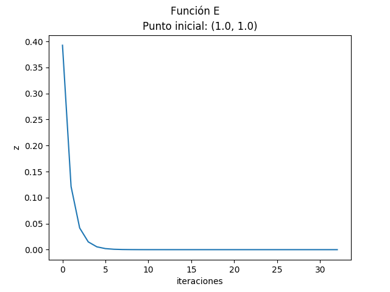

###### José Javier Alonso Ramos --- Computación y Sistemas Inteligentes ---  
# Aprendizaje Automático  
## Práctica 1  
#### Ejercicio 1.- BÚSQUEDA ITERATIVA DE ÓPTIMOS

___  

1. ___Implementar algoritmo de gradiente Descendente___  

**Descripción:** con este algoritmo tratamos de avanzar hacia el mínimo local de una función más próximo a un punto inicial indicado.  

**Parámetros:**  

- __func:__ indicamos la función sobre la que se aplicará el gradiente descendiente.  
- __grad:__ es un array de dos componentes de las cuales, la primera contiene la derivada parcial respecto a la primera variable de _func_, y la segunda la derivada parcial respecto a la segunda variable de _func_.  
- __u:__ primera coordenada del punto inicial a partir del cual se buscará el mínimo local.  
- __v:__ segunda coordenada del punto inicial a partir del cual se buscará el mínimo local.  
- __maxIter:__ número máximo de iteraciones que realizará el algoritmo. Funciona como condición de parada en caso de no encontrar antes el mínimo local.  
- __epsilon:__ número suficientemente pequeño según el cual consideramos que no ha habido mejora de una iteración a otra del algoritmo. Si la diferencia entre la interpretación de la función _func_ en unas coordenas _(x,y)_ y la interpretación de otras coordenadas _(x',y')_ correspondientes a la siguiente iteración del algoritmo es menor que __epsilon__ paramos el cálculo del mínimo. Por defecto le asignamos un valor de $10^{-14}$.  
$$f(x,y)-f(x',y') < epsilon$$
- __learning_rate:__ el gradiente descendente nos indica hacia qué dirección debemos dirigirnos para tomar nuestra siguiente coordenada a considerar como mínimo. El learning_rate $(\eta)$ indica en qué medida tomamos como válida esa dirección y, por tanto, cuánto avanzamos en esa dirección. Por defecto le asignamos un valor de $0.01$.

**Funcionamiento:** mientras no cumplamos el límite de iteraciones y por cada iteración obtengamos una mejora notable, actualizaremos nuestras coordenadas _(x,y)_ restándole el _gradiente_ calculado multiplicado por el _learning-rate_. $$(x',y')=(x,y)-\eta grad$$.
Al finalizar, el algoritmo devolverá:  

- __w:__ dupla con las coordenadas _(x,y)_ del punto mínimo alcanzado.  
- __it:__ número de iteraciones que han sido necesarias para alcanzar el mínimo.  
- __points2min:__ conjunto de puntos _(x,y)_ que hemos ido obteniendo en cada iteración del algoritmo.  

___  

2. ___Considerar la función $E(u,v)=(u^2e^v-2v^2e^{-u})^2$ . Usar gradiente descendente para encontrar un mínimo de esta función, comenzando desde el punto $(u,v)=(1,1)$ usando una tasa de aprendizaje $\eta=0.01$.___  

- a) ___Calcular analíticamente y mostrar la expresión del gradiente de la función $E(u,v)$.___  

_Gradiente de la función E(u,v)_:  
$$grad(E(u,v)) = (\delta E_u(u,v), \delta E_v(u,v))$$  
_Derivada de E respecto a 'u'_  
$$\delta E_u = {\delta \over \delta u}[(u^2 e^v - 2v^2 e^{-u}) ^2]$$  
_Aplicamos la regla de la potencia._  
$$\delta E_u = 2(u^2 e^v - 2v^2 e^{-u}) {\delta \over \delta u}[u^2 e^v - 2v^2 e^{-u}]$$  
_Derivamos los términos por eseparado._  
$$\delta E_u = 2(u^2 e^v - 2v^2 e^{-u})(e^v {\delta \over \delta u}[u^2] - 2v^2 {\delta \over \delta u}[e^{-u}])$$  
_Resultado de la derivada parcial respecto 'u'_:  
$$\delta E_u = 2(u^2 e^v - 2v^2 e^{-u})(2e^v u + 2v^2 e^{-u})$$  

_Derivada de E respecto a 'v'_  
$$\delta E_v = {\delta \over \delta u}[(u^2 e^v - 2v^2 e^{-u})^2]$$  
_Aplicamos la regla de la potencia._  
$$\delta E_v = 2(u^2 e^v - 2v^2 e^{-u}) {\delta \over \delta u}[u^2 e^v - 2v^2 e^{-u}]$$  
_Derivamos los términos por eseparado._  
$$\delta E_v = 2(u^2 e^v - 2v^2 e^{-u})(u^2 {\delta \over \delta u}[e^v] - 2e^{-u} {\delta \over \delta u}[v^2])$$  
_Resultado de la derivada parcial respecto 'v'_:  
$$\delta E_v = 2(u^2 e^v - 2v^2 e^{-u})(e^v u^2 - 4v e^{-u})$$  

___

- b) ___¿Cuántas iteraciones tarda el algoritmo en obtener por primera vez un  valor de $E(u, v)$ inferior a $10^{-14}$?___  

Como mostramos en una tabla más adelante, se realizan ***33*** iteraciones.  

___

- c) ___¿En qué coordenadas $(u,v)$ se alcanzó por primera vez un valor igual o menor a $10^{-14}$ en el apartado anterior?___  

Las coordenadas ***(0.619207678450638, 0.9684482690100487)*** son las primeras en las que obtenemos un valor menor o igual a $10^{-14}$.  

| Initial Point |       u |       v  |  lr |   F(u,v)        | iteraciones|
|---------------|---------|----------|-----|-----------------|------------|
|    [1.0, 1.0] |0.6192076|0.96844826| 0.01|5.9973 x 10^(-15)|         33 |

  
Vemos como tiende a una asíntota horizontal cuando se aproxima al minímo.
  
Esta es una representación 3D de la gráfica donde se ven representados el punto incial como una estrella negra y el mínimo alcanzado como una estrella roja. También marcamos los puntos intermedios recorridos en color verde pero, debido a la proximidad del punto inicial con el mínimo, no se distinguen bien.  

___

3. ___Considerar ahora la función $F(x,y) = x^2 + 2y^2 + 2sin(2\pi x) sin(2\pi y)$___  

- a) ___Usar gradiente descendente para minimizar esta función. Usar como punto inicial $(x_0 = 0.1, y_0 = 0.1)$, tasa de aprendizaje $\eta = 0.01$ y un máximo de 50 iteraciones. Generar un gráfico de cómo desciende el valor de la función con las iteraciones. Repetir el experimento pero usando $\eta = 0.1$, comentar las diferencias y su dependencia de $\eta$.___  

$$\delta F_u(u,v) = 4\pi sin(2\pi v) cos(2\pi u)+2u$$
$$\delta F_v(u,v) = 4\pi sin(2\pi u) cos(2\pi v)+4v$$
$$grad(F_{(u,v)}) = (\delta F_u, \delta F_v)$$  

= = = = = = = = = = = = = = = = = = = = = = = = = = = = = = = =
  
Para $\eta = 0.01$:  
  

Para $\eta = 0.1$:  
  

Comparación:  

| Initial Point |       u |       v  |  lr |   F(u,v) | iteraciones|
|---------------|---------|----------|-----|----------|------------|
|    [0.1, 0.1] |0.243805 | -0.237926| 0.01|-1.820079 |         21 |
|    [0.1, 0.1] |0.898964 | -0.211171| 0.1 | 2.048279 |         50 |

En la gráfica con $\eta = 0.1$ vemos que los valores de la función varían bruscamente. Esto es debido al alto valor de $\eta$.  
Al usar un $\eta = 0.1$ avanzamos demasiado en la dirección indicada por el gradiente de modo que, cuando se aproxima al mínimo, el algoritmo oscila a su alrededor y no consigue converger. Con $\eta = 0.01$, en cambio, avanzamos distancias más pequeñas que nos permiten ir convergiendo en el mínimo.  

___

- b) ___Obtener el valor mínimo y los valores de las variables $(x,y)$ en donde se alcanzan cuando el punto de inicio se fija: $(0.1,0.1), (1,1), (-0.5,-0.5), (-1,-1)$. Generar una tabla con los valores obtenidos___  

Para mostrar como el algoritmo dibuja los puntos intermedios recorridos he añadido a la lista de puntos iniciales $(22.0,22.0)$ en cuya representación gráfica veremos que no consigue convergir a un mínimo y agota las 50 posibles iteraciones.  
_En la ejecución del código se mostrarán las gráficas para todos los puntos._  

  

| Initial Point |       u |       v  |  lr |   F(u,v) | iteraciones|
|---------------|---------|----------|-----|----------|------------|
|    [0.1, 0.1] |0.243805 | -0.237926| 0.01|-1.820079 |         21 |
|    [1.0, 1.0] |1.218070 |  0.712812| 0.01| 0.593269 |         17 |
|  [-0.5, -0.5] |-0.731377| -0.237855| 0.01| -1.332481|         17 |
|      [-1, -1] |-1.218070| -0.712812| 0.01|  0.593269|         17 |
|  [22.0, 22.0] | 7.604608|  3.133128| 0.01| 76.556035|         50 |

___  

4. ___¿Cuál sería su conclusión sobre la verdadera dificultad de encontrar el mínimo global de una función arbitraria?___  

La dificultad recae en lo bueno que sea el punto inicial escogido (que el camino marcado por el gradiente descendente sea hacia el mínimo globlal y no hacia un mínimo local), en que el _learning rate_ escogido sea acertado (permita converger adecuadamente en el mínimo y a su vez no sea demasiado pequeño y haga que la ejecución del algoritmo sea extremadamente larga) y en ser capaces de solucionar o evitar estancamientos en mínimos locales.  

___  
#### Ejercicio 2.- BÚSQUEDA ITERATIVA DE ÓPTIMOS
___Este ejercicio ajusta modelos de regresión a vectores de características extraidos de imágenes de digitos manuscritos. En particular se extraen dos característcas concretas: el valor medio del nivel de gris y simetría del número respecto de su eje vertical. Solo se seleccionarán para este ejercicio las imágenes de los números 1 y 5.___  

1. ___Estimar un modelo de regresión lineal a partir de los datos proporcionados de dichos números (Intensidad promedio, Simetria) usando tanto el algoritmo de la pseudo-inversa como Gradiente descendente estocástico (SGD). Las etiquetas serán {-1, 1}, una para cada vector de cada uno de los números. Pintar las soluciones obtenidas junto con los datos usados en el ajuste. Valorar la bondad del resultado usando E in y E out (para E out calcular las predicciones usando los datos del fichero de test).___  

Para el ***Gradiente Descendente Estocástico*** hemos escogido un tamaño de Minibatch = 64.

$$w_j = w_j - \eta\sum_{n\in Minibatch}[ x_{nj} (h(x_n) - y_n) ]$$  
_j hace referencia a las columnas_  
_n hace referencia a las filas dentro del Minibatch_  

- ***$h(x_n)$:*** nuestra aproximación al valor _y_ asociado a _$x_n$_.
- ***$y_n$:*** valor real asociado a $x_n$.
- ***$x_{nj}$:*** columna del atributo _j_ perteneciente al minibatch _n_.
- ***$\eta$:*** learning-rate.
- ***$w_j$:*** peso asociado al atributo _j_.  

Para realizar la ***Pseudo-inversa*** nos hemos ayudado de una función del módulo _numpy_ (_numpy.linalg.pinv(X)_).  

$$w = X^{\dagger} Y$$

Para calcular el ***Error medio*** realizamos la sumatoria de la diferencia cuadrática entre nuestra aproximación (_$Xw$_) y el valor real asociado a _X_ (_Y_) dividido por el número de datos.

$$Err = \frac{\sum_{n=1}^N [X w - Y]^2} {N}$$

Acontinuación mostramos en una gráfica 3D la distribución de todos los valores de la muestra X leidos. Pintaremos de rojo aquellos a los que nuestro algoritmo les haya asignado la etiqueta 1 y de azul a los que se les haya asignado la etiqueta -1.  
  

Mostramos el error obtenido con SGD y Pseudo-inversa:  

|           | SGD               | Pseudo-inversa    |
|-----------|-------------------|-------------------|
|$E_{in}$   |0.08262032686662257|0.07918658628900395|
|$E_{out}$  |0.13317636750014467|0.13095383720052584|  

Dibujaremos las rectas asociadas a la regresión:  
    De color azul la correspondiente al SGD  
    De color magenta la correspondiente a la Pseudoinversa  
_Tener en cuenta que los ejes del gráfico indican las dos coordenadas de x_
  

2. ___En este apartado exploramos como se transforman los errores E in y E out cuando aumentamos la complejidad del modelo lineal usado. Ahora hacemos uso de la función simula_unif (N, 2, size) que nos devuelve N coordenadas 2D de puntos uniformemente muestreados dentro del cuadrado definido por [size, size]$\times$[-size,-size]___  

- a) ___Generar una muestra de entrenamiento de N = 1000 puntos en el cuadrado X = [-1, 1]$\times$[-1, 1]. Pintar el mapa de puntos 2D.___  
  

- b) ___Consideremos la función $f(x_{1}, x_2)=sign((x_1-0.2)^2+x_2^2-0.6)$ que usaremos para asignar una etiqueta a cada punto de la muestra anterior. Introducimos ruido sobre las etiquetas cambiando aleatoriamente el signo de un 10% de las mismas. Pintar el mapa de etiquetas obtenido.___  

Para modificar el 10% de la muestra:  

- Calculamos las etiquetas correspondientes a cada dato generado en el apartado _2 a)_ con la función proporcionada.  

- Añadimos a la matriz de puntos 2D una nueva columna que contendrá las etiquetas recién calculadas haciéndolas coincidir con su correspondiente punto 2D.  

- Generamos números aleatorios no repetidos en el rango [0, número de datos), es decir, generamos aleatoriamente los índices que referencian a los datos que vamos a alterar.  

- Cambiamos de signo las etiquetas referenciadas por estos índices.  

Mapa de puntos según etiquetas y mapa de puntos con ruido:  

  

- c) ___Usando como vector de características $(1, x_1, x_2)$ ajustar un modelo de regresion lineal al conjunto de datos generado y estimar los pesos w. Estimar el error de ajuste $E_{in}$ usando Gradiente Descendente Estocástico (SGD).___  
$$E_{in} = 0.9266173649533643$$  

- d) ___Ejecutar todo el experimento definido por (a)-(c) 1000 veces (generamos 1000 muestras diferentes) y___
    - ___Calcular el valor medio de los errores E in de las 1000 muestras.___
    - ___Generar 1000 puntos nuevos por cada iteración y calcular con ellos el valor de E out en dicha iteración. Calcular el valor medio de E out en todas las iteraciones.___  

_Error medio tras 1000 iteraciones:_  
$E_{in}$ medio:  0.9273397180289497  
$E_{out}$ medio:  0.9320711718563939  
  
- e) ___Valore que tan bueno considera que es el ajuste con este modelo lineal a la vista de los valores medios obtenidos de $E_{in}$ y $E_{out}$___  

Debido a la distribución de los puntos no podemos realizar un buen ajuste con un modelo lineal. El haber alterado un 10% de la muestra no es motivo sufuciente para obtener unos resultados tan malos.  
No podemos tomar por bueno un ajuste con un error $E \simeq 0.9$.  

Para intentar realizar un mejor ajuste deberíamos probar con un modelo no lineal.  

___  
#### Ejercicio 3.- BONUS - NEWTON'S METHOD  
$$\bigtriangleup w = -H^{-1} \bigtriangledown E_{in}(w)$$  
En este método acompaña al learning-rate ($\eta$) la matriz Hessiana que, al igual que $\eta$, nos indicará en qué medida debemos hacer caso a lo que nos indica el gradiente.  

La matriz Hessiana está compuesta por lo siguiente:  

$$H = 
\left(\begin{array}{cc} 
\delta F_{uu} & \delta F_{uv}\\
\delta F_{vu} & \delta F_{vv}
\end{array}\right)$$  

Siendo:  
$$\delta F_{uu} = 2-8\pi^2 sin(2\pi v) sin(2\pi u)$$
$$\delta F_{uv} = 8\pi^2 cos(2\pi u) cos(2\pi v)$$
$$\delta F_{vv} = 4-8\pi^2 sin(2\pi u) sin(2\pi v)$$
$$\delta F_{vu} = 8\pi^2 cos(2\pi v) cos(2\pi u)$$

Vamos a comparar los resultados con los obtenidos en el ejercicio 1.3:  

- ___Para el punto (0.1, 0.1):___  
Gradiente:  
  
Newton:  
  
- ___Para el punto (1, 1):___  
Gradiente:  
  
Newton:  
  
- ___Para el punto (-1, -1):___  
Gradiente:  
  
Newton:  
  
- ___Para el punto (-0.5, -0.5):___  
Gradiente:  
  
Newton:  
  

| Initial Point |       u |       v  |  lr |   F(u,v) | iteraciones|
|---------------|---------|----------|-----|----------|------------|
|    [0.1, 0.1] |0.000368 |  0.000364| 0.1 | 0.000011 |         50 |
|    [1.0, 1.0] |0.949409 |  0.974715| 0.1 | 2.900408 |         50 |
|  [-0.5, -0.5] |-0.475244| -0.487869| 0.1 | 0.725483 |         50 |
|      [-1, -1] |-1.949409| -0.974715| 0.1 | 2.900408 |         50 |  

El método de Newton tiende a converger a 0 aunque en los puntos $(\pm 1, \pm 1)$ no lo logre. Por lo tanto el gradiente descendente consigue mejores resultados pudiendo alcanzar valores negaivos.