---
title: "Trabajo 2"
author: [José Javier Alonso Ramos]
dni: "77766199-W"
date: "Curso: 2018 - 2019"
email: "jjavier.ar98@gmail.com"
group: "Grupo: 2"
subject: "Markdown"
keywords: [Markdown, Example]
subtitle: "Programación"
lang: "es"
titlepage: true
titlepage-rule-height: 1
logo: "images/logoUGR/3.png"
logo-width: 300
toc: TRUE
toc-own-page: TRUE
titlepage-color: e0fbff
titlepage-text-color: 110406
...
# Ejercicio 1.- Ejercicio sobre la complejidad de H y el ruido  

## 1. Dibujar una gráfica con la nube de puntos de salida correspondiente a:  

### a) Considere N = 50, dim = 2, rango = [−50, +50] con simula_unif (N, dim, rango)   

Usando la función _simula\_unif_ generaremos 50 puntos de dos dimensiones en el cuadrado [-50,50]x[-50,50] según una distribución uniforme.  
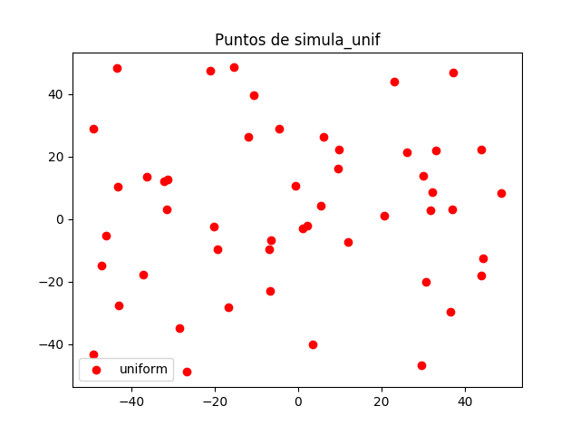{width=400}  

### b) Considere N = 50, dim = 2 y sigma = [5, 7] con simula_gaus(N, dim, sigma)   

Usando la función _simula\_gaus_ generaremos 50 puntos de dos dimensiones según una distribución gausiana de media 0 y varianza 5 para la primera dimensión y varianza 7 para la segunda.  
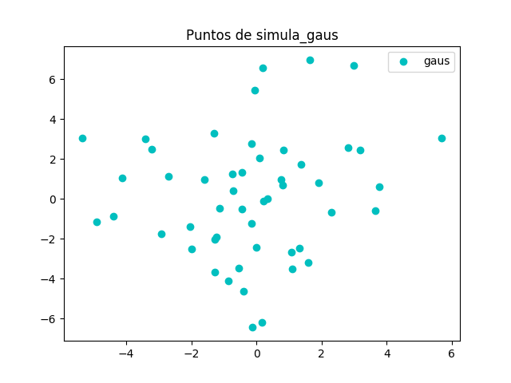{width=400}  
Para comparar las nubes de puntos pintamos todas las coordenadas 2D en una misma gráfica.  
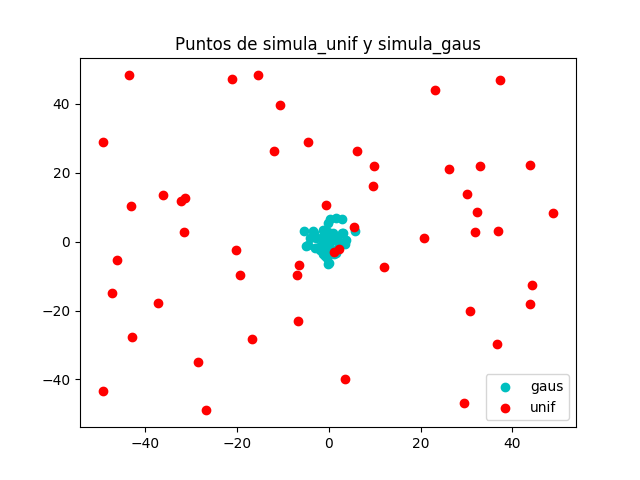{width=400}  

## 2. Con ayuda de la función simula_unif() generar una muestra de puntos 2D a los que vamos añadir una etiqueta usando el signo de la función $f (x, y) = y - ax - b$, es decir el signo de la distancia de cada punto a la recta simulada con simula_recta().  

__recta_y:__ calcula la coordenada 'y' de la recta ax+b. 'a', 'b' y 'x' son parámetros de la función.  

__distancia_a_la_recta:__ Devuelve el signo de la distancia que hay entre un punto en el plano y la recta anterior

### a) Dibujar una gráfica donde los puntos muestren el resultado de su etiqueta, junto con la recta usada para ello. (Observe que todos los puntos están bien clasificados respecto de la recta) 

Con ayuda de la función simula_recta obtendremos los coeficientes 'a' y 'b' de nuestra recta.  
Generamos dos puntos cualesquiera en el eje X que servirán como primera coordenada para crear nuestra recta.  
Calculamos las coordenadas 'y' asociadas a las coordenadas 'x' anteriores con la función recta_y.  
De nuevo con simula_unif generaremos una muestra de 100 puntos 2D en el cuadrado [-50,50]x[-50,50].  
Calculamos las etiquetas de estos puntos con distancia_a_la_recta.  
Dibujamos de un color los puntos que quedan por encima de la recta y de otro color diferente los que quedan por debajo.  
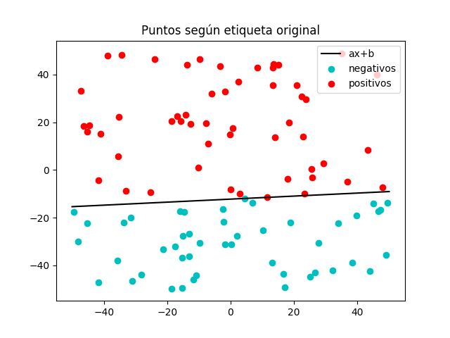{width=400}  

### b) Modifique de forma aleatoria un 10 % etiquetas positivas y otro 10 % de negativas y guarde los puntos con sus nuevas etiquetas. Dibuje de nuevo la gráfica anterior. ( Ahora hay puntos mal clasificados respecto de la recta)  

Separamos el conjunto de datos según sus etiquetas y cambiamos al azar la etiqueta de un 10% de elementos de cada grupo.  

Lo realizamos de la siguiente manera:  
Una vez separados los datos los mezclamos de manera aleatoria individualmente, calculamos cuántos elementos conforman cada grupo y calculamos el 10% de este número (10% * N = n). Al estar mezclados de forma aleatoria solo tenemos que cambiar los n primeros elementos de cada conjunto.  

Después de esto volvemos a juntar los conjuntos en uno solo y volvemos a imprimir la gráfica como en el apartado anterior.  
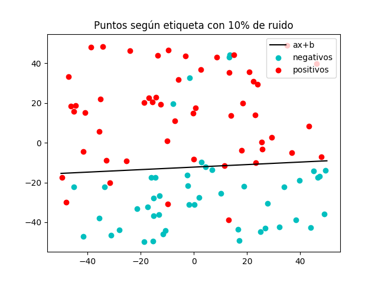{width=400}  

## 3. Supongamos ahora que las siguientes funciones definen la frontera de clasificación de los puntos de la muestra en lugar de una recta. Visualizar el etiquetado generado en 2b junto con cada una de las gráficas de cada una de las funciones. Comparar las formas de las regiones positivas y negativas de estas nuevas funciones con las obtenidas en el caso de la recta ¿Son estas funciones más complejas mejores clasificadores que la función lineal? ¿En que ganan a la función lineal? Explicar el razonamiento.  
- $f (x, y) = (x − 10) 2 + (y − 20) 2 − 400$
- $f (x, y) = 0,5(x + 10) 2 + (y − 20) 2 − 400$
- $f (x, y) = 0,5(x − 10) 2 − (y + 20) 2 − 400$
- $f (x, y) = y − 20x 2 − 5x + 3$  

En las gráficas anteriores sustituimos la recta por las funciones dadas para comprobar cómo de bien clasifican los datos con ruido. Para dibujarlas usaremos la función _contour_ del módulo matplotlib.  
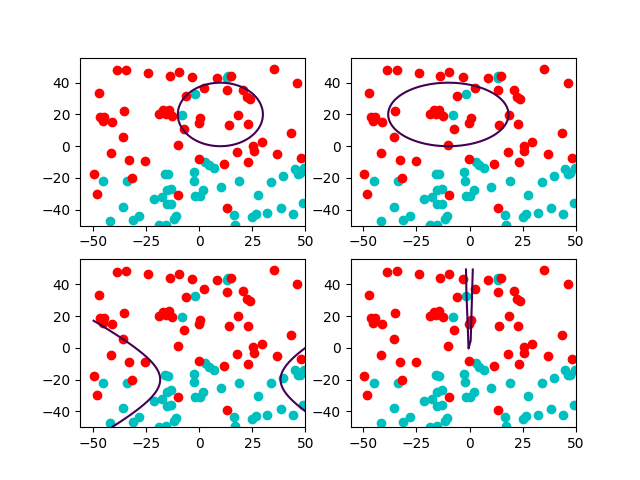{width=400}  
Como vemos no tiene nada que ver la complejidad de una función con su capacidad para clasificar bien un determinado conjunto de datos. Lo único que pueden conseguir estas funciones respecto a la clasificación por medio de la recta es clasificar bien un conjunto de datos que no sea linealmente separable pero, como este no es el caso, la clasificación es muy mala.  

Como ejemplo de clasificación de conjuntos de datos no linealmente separable, tomaremos como etiquetas la distancia de los puntos a las propias funciones. Como es obvio, en este caso clasifican bien y además observamos que no podríamos llevar a cabo esta clasificación con una recta.  
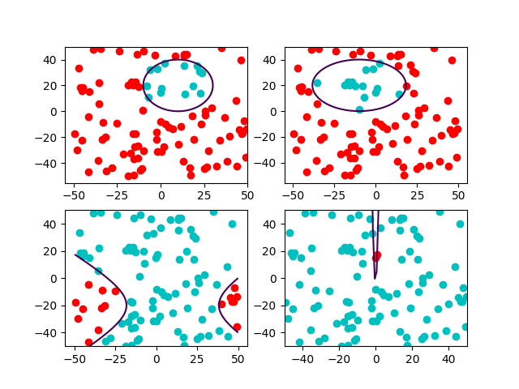{width=400}  

# Ejercicio 2.- MODELOS LINEALES  

## 1. Algoritmo Perceptron: Implementar la función ajusta_PLA(datos, label, max_iter, vini) que calcula el hiperplano solución a un problema de clasificación binaria usando el algoritmo PLA. La entrada datos es una matriz donde cada item con su etiqueta está representado por una fila de la matriz, label el vector de etiquetas (cada etiqueta es un valor +1 o −1), max_iter es el número máximo de iteraciones permitidas y vini el valor inicial del vector. La función devuelve los coeficientes del hiperplano.  

Para construir el algoritmo nos ayudaremos de una función error que simplemente contará el número de etiquetas mal calculadas con un determinado vector de pesos.  
El algoritmo PLA irá corrigiendo el vector de pesos hasta que el error obtenido sea igual a 0 (hemos encontrado solución para un conjunto de datos linealmente separable) o hasta alcanzar un límite de iteraciones.   
En la ejecución del programa se imprimen gráficos que muestran como va convergiendo w hasta una solución. Realmente mostramos el error que obtenemos según va evolucionando. En el caso del apartado b no se produce esta convergencia y no alcanza el 0 (recordar que es el error).  

### a) Ejecutar el algoritmo PLA con los datos simulados en los apartados 2a de la sección.1. Inicializar el algoritmo con: a) el vector cero y, b) con vectores de números aleatorios en [0, 1] (10 veces). Anotar el número medio de iteraciones necesarias en ambos para converger. Valorar el resultado relacionando el punto de inicio con el número de iteraciones.**  

|   | W_inicial | W_final | iteraciones |
|---------------|----------|----------|------------|
|     w_0     | [1. 0.         0.]         | [1. 0.00245099 0.0883308 ] | 151 |
|   w_rand 1  | [1. 0.47229298 0.50287715] | [1. 0.00396749 0.09041206] | 180 |
|   w_rand 2  | [1. 0.75178218 0.82419936] | [1. 0.00342724 0.08646916] | 129 |
|   w_rand 3  | [1. 0.31847982 0.54695934] | [1. 0.         0.08148513] | 81  |
|   w_rand 4  | [1. 0.42990475 0.18663381] | [1. 0.0010412  0.08720709] | 183 |
|   w_rand 5  | [1. 0.28544506 0.99417813] | [1. 0.00371814 0.08952745] | 161 |
|   w_rand 6  | [1. 0.3340604  0.05248382] | [1. 0.00243349 0.08913514] | 193 |
|   w_rand 7  | [1. 0.56043346 0.77723743] | [1. 0.00302331 0.08727604] | 173 |
|   w_rand 8  | [1. 0.27165909 0.07187662] | [1. 0.00291858 0.0878521 ] | 183 |
|   w_rand 9  | [1. 0.47281241 0.87118406] | [1. 0.00180849 0.08507219] | 184 |
|   w_rand 10 | [1. 0.73999017 0.35502322] | [1. 0.00498287 0.09215298] | 138 |
|    |  |  | mean(w_rand): 160.5 |

Como vemos influye mucho el punto de partida en el tiempo (iteraciones) necesario para alcanzar un vector de pesos w que nos clasifique bien los datos. Podemos observar que no hay mucha diferencia entre los vectores w_final ya que, al fin y al cabo, deben clasificar de igual manera el mismo conjunto de datos.  
Sabiendo que nuestro conjunto es linealmente separable podemos marcar como máximo de iteraciones para el algoritmo PLA un número tan grande como queramos, pues sabemos que al final encontrará una solución.  

### b) Hacer lo mismo que antes usando ahora los datos del apartado 2b de la sección.1. ¿Observa algún comportamiento diferente? En caso afirmativo diga cual y las razones para que ello ocurra.  

En este caso el conjunto de datos no es linealmente separable por lo que el algoritmo PLA nunca encontrará una solución y permanecerá oscilando hasta fin de iteraciones. Por ello debemos fijar un número finito de iteraciones y que sea suficiente como para percatarnos de que no va a encontrar solución.  

|   | W_inicial | W_final | iteraciones |
|---------------|----------|----------|------------|
|     w_0     | [1. 0.         0.]         | [1. 0.08610512 0.20705893] | 300 |
|   w_rand 1  | [1. 0.89268896 0.75880957] | [1. 0.05589152 0.19553241] | 300 |
|   w_rand 2  | [1. 0.32358254 0.90640251] | [1. 0.02411092 0.20823745] | 300 |
|   w_rand 3  | [1. 0.43612238 0.36716198] | [1. 0.0149948  0.22740741] | 300 |
|   w_rand 4  | [1. 0.31992489 0.90978729] | [1. 0.05013638 0.16572915] | 300 |
|   w_rand 5  | [1. 0.75530216 0.78108358] | [1. 0.02616939 0.21006742] | 300 |
|   w_rand 6  | [1. 0.64099682 0.73458137] | [1. 0.05066714 0.17670907] | 300 |
|   w_rand 7  | [1. 0.01065863 0.42854875] | [1. 0.09719556 0.29270199] | 300 |
|   w_rand 8  | [1. 0.78487183 0.91785011] | [1. 0.02263545 0.21944284] | 300 |
|   w_rand 9  | [1. 0.5224812  0.6885668 ] | [1. 0.01565324 0.21608556] | 300 |
|   w_rand 10 | [1. 0.95193497 0.557923  ] | [1. 0.01711143 0.2171846 ] | 300 |
|    |  |  | mean(w_rand): 300 |

Como vemos, en todos los casos se alcanza el máximo de iteraciones y los pesos de w ni siquiera se parecen a los obtenidos antes y, aunque lo hicieran, tampoco clasificaría correctamente debido al ruido en los datos.  

## 2. Regresión Logística: En este ejercicio crearemos nuestra propia función objetivo f (una probabilidad en este caso) y nuestro conjunto de datos D para ver cómo funciona regresión logística. Supondremos por simplicidad que f es una probabilidad con valores 0/1 y por tanto que la etiqueta y es una función determinista de x. Consideremos d = 2 para que los datos sean visualizables, y sea X = [0, 2] × [0, 2] con probabilidad uniforme de elegir cada x $\in$ X . Elegir una línea en el plano que pase por X como la frontera entre f (x) = 1 (donde y toma valores +1) y f (x) = 0 (donde y toma valores −1), para ello seleccionar dos puntos aleatorios del plano y calcular la línea que pasa por ambos. Seleccionar N = 100 puntos aleatorios {x n } de X y evaluar las respuestas {y n } de todos ellos respecto de la frontera elegida.  

Para realizar este ejercicio contaremos con funciones auxiliares como son:  

- Función sigmoide que toma como parámetro la potencia a la que se eleva e
- Función h que evalúa el sigmoide con el resultado de la multiplicación de sus dos parámetros.
- Función loss que evalúa el error al comparar las etiquetas y de un conjunto de datos x con las calculadas usando w.
- Función gradient que es la derivada de la función loss y la que queremos optimizar.

### a) Implementar Regresión Logística(RL) con Gradiente Descendente Estocástico (SGD) bajo las siguientes condiciones:
- Inicializar el vector de pesos con valores 0.
- Parar el algoritmo cuando ||w (t−1) − w (t) || < 0,01, donde w (t) denota el vector de pesos al final de la época t. Una época es un pase completo a través de los N datos.
- Aplicar una permutación aleatoria, 1, 2, . . . , N , en el orden de los datos antes de usarlos en cada época del algoritmo.
- Usar una tasa de aprendizaje de $\eta$ = 0,01  

La función de regresión logística comienza inicializando el vector de pesos a 0. A continuación ejecuta, como máximo, tantas épocas como le pasemos como parámetro (por defecto 500). En cada época guardamos una copia del vector de pesos antes de modificarlo, mezclamos los datos y etiquetas del conjunto de entrada y lo recorremos por minibatches (el tamaño del minibatch por defecto es 1). Evaluamos la función gradiente para cada minibatch y le restamos al vector w el resultado multiplicado por el learning-rate. Si la diferencia (medida como distancia euclídea) entre el vector de pesos antes de ser modificado y después de aplicarle el gradiente es menor que un épsilon dado (en este caso 0.01) saldremos del bucle.  

Para calcular nuestro vector de pesos generamos 100 puntos 2D en el cuadrado [0,2]x[0,2]. Generamos unos coeficientes 'a' y 'b' para generar una recta con simula_recta. Etiquetamos los datos según esta recta; si la distancia es negativa la etiqueta será 0 y si la distancia es positiva la etiqueta será 1. Pasamos este conjunto junto con sus etiquetas a la función de regresión logística para obtener nuestro vector de pesos w junto con el conjunto de errores que hemos ido obteniendo y el número de iteraciones realizadas que coincide con el número de épocas.  
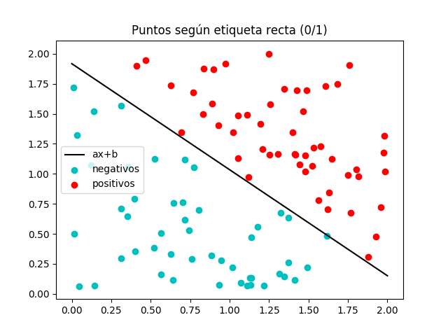{width=400}  
Para este conjunto de datos obtenemos w = [-9.87129378  4.76336315  5.18680234]  
y con el clasificamos el conjunto anterior:  
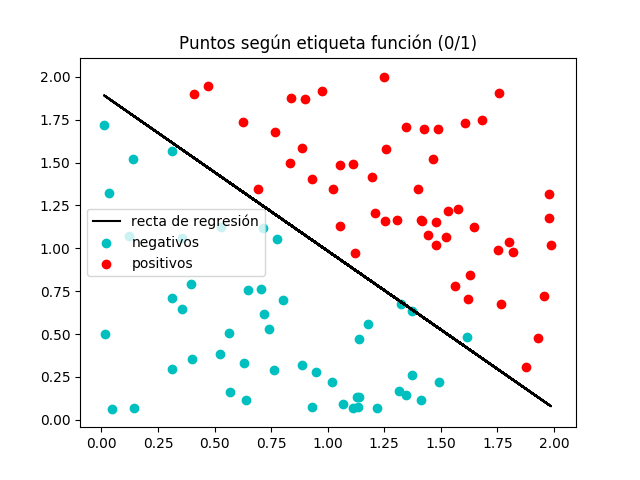{width=400}  
Obtenemos la siguiente evolución del error:  
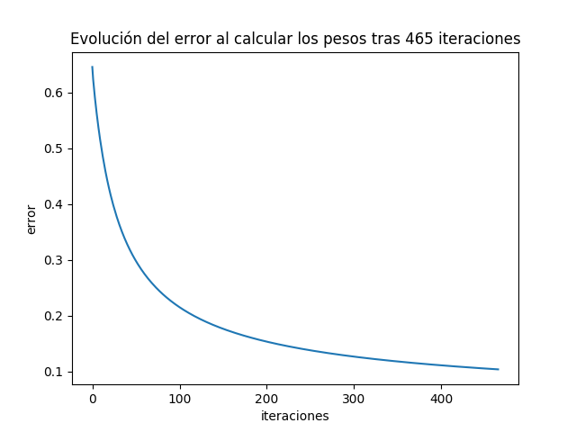{width=400}  
Y obtenemos como Ein: 0.10354740792445241  

### b) Usar la muestra de datos etiquetada para encontrar nuestra solución g y estimar E out usando para ello un número suficientemente grande de nuevas muestras (>999).  

Con el vector w calculado antes clasificaremos 1000 conjuntos de 100 datos cada uno etiquetados con la misma recta que el conjunto de entrenamiento.  
Imprimiremos una gráfica del error obtenido para cada conjunto y mostraremos el Eout medio.  

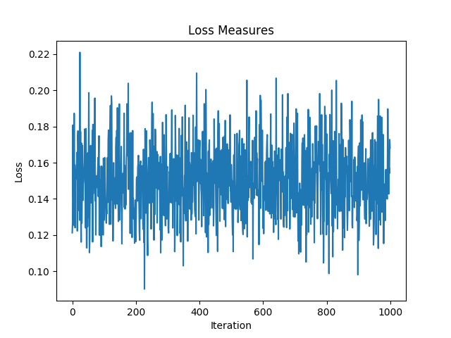{width=400}  
Eout medio = 0.15040347308219576