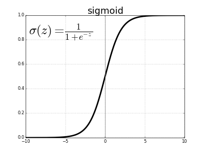

# Preguntas

##1. Identificar, para cada una de las siguientes tareas, cual es el problema, que tipo de aprendizaje es el adecuado (supervisado, no supervisado, por refuerzo) y los elementos de aprendizaje ($X , f, Y$) que deberíamos usar en cada caso. Si una tarea se ajusta a más de un tipo, explicar como y describir los elementos para cada tipo.

**a) Clasificación automática de cartas por distrito postal:**

A mi parecer se trata de un problema de diseño ya que cada código tiene asignada una ciudad unívoca, e incluso cada prefijo  de dos dígitos del código se corresponde con una provincia. Podríamos diseñar un método que nos agrupase perfectamente las cartas por distritos sin necesidad de un algoritmo de aprendizaje.

Si por algún casual no pudiésemos organizar los códigos postales de esa manera utilizaríamos aprendizaje supervisado. El programa aprendería a partir de una muestra, corroborando que el distrito asignado es realmente el que le corresponde.

**b) Decidir si un determinado índice del mercado de valores subirá o bajará dentro de un periodo de tiempo fijado.**

Se trata de un problema que requiere aprendizaje supervisado. El programa deberá aprender qué características son más importantes en la evolución de un determinado índice de valores a través de datos previos. Si disponemos de datos previos y de los resultados obtenidos pasado un tiempo a partir de ellos, el programa podrá aprender a predecir como evolucionará cierta situación en un determinado momento.

**c) Hacer que un dron sea capaz de rodear un obstáculo.**

Si entendemos dron como, según lo define la RAE, una aeronave no tripulada, debemos suponer que el dron va suficientemente lento y tiene la suficiente protección como para aguantar posibles choques sin derribarse o un tiempo suficiente para detectar el obstáculo (si se tratase de un robot terrestre tendríamos que suponer las mismas condiciones pero son más fáciles de cumplir).

Se trata de un problema de aprendizaje por refuerzo ya que el dron realizaría una acción y, atendiendo a las consecuencias de esta, tomaría una decisión u otra. Por ejemplo, un robot aspirador que está siguiendo un itinerario y se encontrase con un obstáculo lo detectaría con un sensor (láser, de choque, de imagen, ...), registraría que ahí hay un obstáculo para la próxima vez que pasase bordearlo sin problemas y aprendería a reconocer a otro futuro obstáculo si lo vuelve a detectar por un sensor. El resultado sería modificar el itinerario para llegar a su destino evitando el obstáculo.

**d) Dada una colección de fotos de perros, posiblemente de distintas razas, establecer cuantas razas distintas hay representadas en la colección.**

Es un problema de aprendizaje no supervisado. El programa tendrá que agrupar a los perros según sus características comunes y manteniendo separados aquellos que no compartan rasgos que el programa interprete como distintivas, creando así grupos que posiblemente coincidan con una clasificación por razas.

##2. ¿Cuales de los siguientes problemas son más adecuados para una aproximación por aprendizaje y cuales más adecuados para una aproximación por diseño? Justificar la decisión

**a) Determinar si un vertebrado es mamífero, reptil, ave, anfibio o pez.**

Este problema lo podríamos afrontar con una aproximación por diseño dado que las características distintivas necesarias para clasificar a un animal vertebrado están muy claras y son suficientemente pocas.  
Algunos de estos rasgos tan distintivos podrían ser: ¿Tiene pelo?, ¿Tiene pico?, ¿Tiene escamas?, ¿Respira dentro y fuera del agua?, etc. 

No necesitamos un algoritmo de aprendizaje que nos ayude a encontrar un patrón en las características de los vertebrados para poder clasificarlos.

**b) Determinar si se debe aplicar una campaña de vacunación contra una enfermedad.**

Al igual que antes podemos afrontar el problema por medio del diseño. Podemos obtener una solución al problema por medio de unas "pocas" características que, además, podemos formular de manera binaria para simplificarlas aún más: ¿La enfermedad está erradicada?, ¿nos encontramos en una zona geográfica que se vea afectada por esta enfermedad?, ¿Un porcentaje significativo de nuestra población está en riesgo?. En definitiva una serie de características muy deterministas por las que no vemos necesario aplicar aprendizaje para encontrar un patrón complejo que nos ayude a decidir.

De todas formas, desde un punto de vista sanitario, social, político e incluso económico la respuesta siempre debe tender a sí aplicar la vacuna para disminuir riesgo de enfermedad.

**c) Determinar perfiles de consumidor en una cadena de supermercados.**

A priori no podemos definir un perfil de consumidor observando sus artículos de compra, dinero gastado, frecuencia de compra, ... El patrón que defina dicho perfil es suficientemente complejo como para necesitar un algoritmo automatizado que lo encuentre por nosotros. Por lo tanto afrontaremos este problema mediante una aproximación por aprendizaje.

**d) Determinar el estado anímico de una persona a partir de una foto de su cara.**

Este problema lo afrontaremos mediante aprendizaje. La combinación de distintos rasgos faciales pueden generar conjuntos de patrones suficientemente grandes y complejos como para ser  difíciles de interpretar. Una sonrisa no siempre significa alegría; debemos tener en cuenta otros rasgos faciales que en su conjunto nos deriven a pensar que una persona se encuentra en un determinado estado anímico. Debemos analizar cada rasgo y la relación entre ellos para poder llegar a una conclusión. Esta tarea es demasiado compleja como para realizarla por diseño.

**e) Determinar el ciclo óptimo para las luces de los semáforos en un cruce con mucho tráfico.**

De nuevo se nos presenta un problema que abordaremos mediante aprendizaje. Estudiando la situación a lo largo de suficientes días podemos deducir el comportamiento complejo de los vehículos en un cruce. Estimar las horas punta en las que se concentra más tráfico, día de la semana en el que realizamos el estudio, desde dónde y hacia dónde se dirige la mayor afluencia de vehículos, diferenciar entre un comportamiento diurno y nocturno, ... En definitiva, distintas variables que pueden resultar complejas de estudiar dado que dicho cruce se encuentra integrado en un sistema mayor de carreteras del que depende y del que nos resultaría complejo abstraernos en un problema de diseño.

##3. Construir un problema de aprendizaje desde datos para un problema de clasificación de fruta en una explotación agraria que produce mangos, papayas y guayabas. Identificar los siguientes elementos formales $X,Y,D,f$ del problema. Dar una descripción de los mismos que pueda ser usada por un computador. ¿Considera que en este problema estamos ante un caso de etiquetas con ruido o sin ruido? Justificar las respuestas.

Nuestro conjunto X, que consideramos en este caso aislado como población, será todo el conjunto de frutas (mangos + papayas + guayabas) de nuestra explotación agraria caracterizadas según distintos criterios como: peso, color, tamaño, forma, aspereza de la piel, ...

El conjunto Y lo conforman las distintas etiquetas asignadas a cada elemento de X. Cada $x_{i}\in X$ tiene asignada una etiqueta $y_{i}\in Y$ que será mango, papaya o guayaba. Este conjunto Y puede contener ruido, es decir, la etiqueta asignada a un elemento de $x_{i}$ puede no coincidir con la fruta que es realmente y la cual se encuentra descrita. Esto se debe a que las tres frutas crecen y maduran en la misma temporada y las tres pueden llegar a tener características tan similares que deriven en una deducción errónea en un momento dado (peso, color, tamaño parecido).

El conjunto D será un subconjunto representativo de X junto con sus etiquetas al que llamaremos muestra y mediante el cual intentaremos aprender un método de clasificación óptimo de los elementos de X. Este método lo denominamos f, una función que asigna inequívocamente una etiqueta $y_{i}$ a un elemento $x_{i}$. Normalmente, no conseguiremos f como tal, sino una aproximación más o menos acertada.

##4. Suponga una matriz cuadrada A que admita la descomposición $A = X^TX$ para alguna matriz $X$ de números reales. Establezca una relación entre los valores singulares de las matriz $A$ y los valores singulares de $X$.

Descomponemos A, X y $X^{T}$ en valores singulares:  
$$ 
A=U_{A} D_{A} V^{T}
$$

$$ 
X=U_{x} D_{x} V_{x}^{T}
$$

$$ 
X^{T}=V_{x} D_{x}^{T} U^{T}
$$

Como $A = X^TX$, sustituimos los valores singulares de cada matriz:

$$ 
A=X^{T} X=V_{x} D_{x}^{T} U_{x}^{T} U_{x} D_{x} V_{x}^{T}
$$

Como U es una matriz unidad. La multiplicación $U_{x}^{T} U_{x}$ es igual a la identidad $I$.

$$
A=V_{x} D_{x}^{T} D_{x} V_{x}^{T}
$$

La matriz D es diagonal y por lo tanto $D^T = D$

$$
A=V_{x} D_{x}^{2} V_{x}^{T}
$$

Si lo igualamos a los valores singulares de A tenemos que:

$A=U_{A} D_{A} V^{T}=V_{x} D_{x}^{2} V_{x}^{T}$

$$U_{A} = V_{x}$$

$$D_{A}=D_{x}^{2}$$

$$V_{A}^{T}=V_{x}^{T}$$

##5. Sean x e y dos vectores de características de dimensión M × 1. La expresión

$$\operatorname{cov}(\mathbf{x}, \mathbf{y})=\frac{1}{M} \sum_{i=1}^{M}\left(x_{i}-\overline{x}\right)\left(y_{i}-\overline{y}\right)$$

**define la covarianza entre dichos vectores, donde $\overline{z}$ representa el valor medio de los elementos de $z$. Considere ahora una matriz X cuyas columnas representan vectores de características. La matriz de covarianzas asociada a la matriz $X = (x_1, x_2, \dots , x_N )$ es el conjunto de covarianzas definidas por cada dos de sus vectores columnas. Es decir,**

$$ \operatorname{cov}(\mathrm{X})=\left( \begin{array}{cccc}{\operatorname{cov}\left(\mathbf{x}_{1}, \mathbf{x}_{1}\right)} & {\operatorname{cov}\left(\mathbf{x}_{1}, \mathbf{x}_{2}\right)} & {\cdots} & {\operatorname{cov}\left(\mathbf{x}_{1}, \mathbf{x}_{N}\right)} \\ {\operatorname{cov}\left(\mathbf{x}_{2}, \mathbf{x}_{1}\right)} & {\operatorname{cov}\left(\mathbf{x}_{2}, \mathbf{x}_{2}\right)} & {\cdots} & {\operatorname{cov}\left(\mathbf{x}_{2}, \mathbf{x}_{N}\right)} \\ {\cdots} & {\cdots} & {\cdots} & {\cdots} \\ {\operatorname{cov}\left(\mathbf{x}_{N}, \mathbf{x}_{1}\right)} & {\operatorname{cov}\left(\mathbf{x}_{N}, \mathbf{x}_{2}\right)} & {\cdots} & {\operatorname{cov}\left(\mathbf{x}_{N}, \mathbf{x}_{N}\right)}\end{array}\right) $$

**Sea ${1_M}^T$ = $(1, 1, \dots , 1)$ un vector $M \times 1$ de unos. Mostrar que representan las siguientes expresiones:**

**a) $E 1=11^{T} \mathrm{X}$**

Empezaremos por multiplicar $11^{T}$ y a la matriz resultado la denotaremos como $A$ que resultará en una matriz de unos de forma MxM:

$$
A = \left( \begin{array}{c}{1} \\ {1} \\ {\vdots} \\ {1}\end{array}\right) (1,1 \cdots 1) = \left( \begin{array}{ccc}{1} & {\cdots} & {1} \\{\vdots} & {\vdots} & {\vdots} \\ {1} & {\cdots} & {1}\end{array}\right)
$$

Por último multiplicamos $A\mathrm{X}$ para obtener la matriz E1 donde cada posición tiene el valor de la sumatoria de todos los valores de columna. La matriz tendrá la forma $(MxM)x(MxN)=(MxN)$.

Siguiendo la notación de los vectores columna $x_{i}$ marcaremos el índice del vector en primera posición y la posición dentro de ese vector en segunda posición. Así la posición 5 del vector columna 3 será $x_{3 5}$.

$$
E1 = A\mathrm{X} = \left( \begin{array}{cccc}
{\sum_{i=0}^{M} x_{1 i}} & {\sum_{i=0}^{M} x_{2 i}} & {\cdots} & {\sum_{i=0}^{M} x_{N i}} \\
{\sum_{i=0}^{M} x_{1 i}} & {\sum_{i=0}^{M} x_{2 i}} & {\cdots} & {\sum_{i=0}^{M} x_{N i}} \\
{\vdots} & {\vdots} & {\vdots} & {\vdots} \\
{\sum_{i=0}^{M} x_{1 i}} & {\sum_{i=0}^{M} x_{2 i}} & {\cdots} & {\sum_{i=0}^{M} x_{N i}}
\end{array}\right)
$$

**b) $E 2=\left(\mathrm{X}-\frac{1}{M} E 1\right)^{T}\left(\mathrm{X}-\frac{1}{M} E 1\right)$**

Si operamos $\frac{1}{M} E 1$ tenemos:

$$
\left( \begin{array}{cccc}
\frac{1}{M}{\sum_{i=0}^{M} x_{1 i}} & \frac{1}{M}{\sum_{i=0}^{M} x_{2 i}} & {\cdots} & \frac{1}{M}{\sum_{i=0}^{M} x_{N i}} \\
\frac{1}{M}{\sum_{i=0}^{M} x_{1 i}} & \frac{1}{M}{\sum_{i=0}^{M} x_{2 i}} & {\cdots} & \frac{1}{M}{\sum_{i=0}^{M} x_{N i}} \\
{\vdots} & {\vdots} & {\vdots} & {\vdots} \\
\frac{1}{M}{\sum_{i=0}^{M} x_{1 i}} & \frac{1}{M}{\sum_{i=0}^{M} x_{2 i}} & {\cdots} & \frac{1}{M}{\sum_{i=0}^{M} x_{N i}}
\end{array}\right)
$$

La expresión $\frac{1}{M}{\sum_{i=0}^{M} x_{1 i}}$ denota la media del vector columna $x_{1}\rightarrow\overline{x_{1}}$

Por lo tanto la resta $\mathrm{X}-\frac{1}{M} E 1$, que definiremos como matriz C, tiene la siguiente forma:

$$
C = \mathrm{X}-\frac{1}{M} E 1 = 
\left( \begin{array}{cccc}
x_{1 1}-\overline{x_{1}} & x_{2 1}-\overline{x_{2}} & {\cdots} & x_{N 1}-\overline{x_{N}} \\
x_{1 2}-\overline{x_{1}} & x_{2 2}-\overline{x_{2}} & {\cdots} & x_{N 2}-\overline{x_{N}} \\
{\vdots} & {\vdots} & {\vdots} & {\vdots} \\
x_{1 M}-\overline{x_{1}} & x_{2 M}-\overline{x_{2}} & {\cdots} & x_{N M}-\overline{x_{N}}
\end{array}\right)
$$

Y su traspuesta:
$$
C^T = 
\left( \begin{array}{cccc}
x_{1 1}-\overline{x_{1}} & x_{1 2}-\overline{x_{1}} & {\cdots} & x_{1 M}-\overline{x_{1}} \\
x_{2 1}-\overline{x_{2}} & x_{2 2}-\overline{x_{2}} & {\cdots} & x_{2 M}-\overline{x_{2}} \\
{\vdots} & {\vdots} & {\vdots} & {\vdots} \\
x_{N 1}-\overline{x_{N}} & x_{N 2}-\overline{x_{N}} & {\cdots} & x_{N M}-\overline{x_{N}}
\end{array}\right)
$$

Si operamos E2 tenemos:
$$
E2 = C^{T} C = 
$$
$$
= \left( \begin{array}{cccc}
\frac{1}{M}{\sum_{i=0}^{M} (x_{1 i} - \overline{x_{1}})(x_{1 i} - \overline{x_{1}})} & \frac{1}{M}{\sum_{i=0}^{M} (x_{1 i} - \overline{x_{1}})(x_{2 i} - \overline{x_{2}})} & {\cdots} & \frac{1}{M}{\sum_{i=0}^{M} (x_{1 i} - \overline{x_{1}})(x_{N i} - \overline{x_{N}})} \\
\frac{1}{M}{\sum_{i=0}^{M} (x_{2 i} - \overline{x_{2}})(x_{1 i} - \overline{x_{1}})} & \frac{1}{M}{\sum_{i=0}^{M} (x_{2 i} - \overline{x_{2}})(x_{2 i} - \overline{x_{2}})} & {\cdots} & \frac{1}{M}{\sum_{i=0}^{M} (x_{2 i} - \overline{x_{2}})(x_{N i} - \overline{x_{N}})} \\
{\vdots} & {\vdots} & {\vdots} & {\vdots} \\
\frac{1}{M}{\sum_{i=0}^{M} (x_{N i} - \overline{x_{N}})(x_{1 i} - \overline{x_{1}})} & \frac{1}{M}{\sum_{i=0}^{M} (x_{N i} - \overline{x_{N}})(x_{2 i} - \overline{x_{2}})} & {\cdots} & \frac{1}{M}{\sum_{i=0}^{M} (x_{N i} - \overline{x_{N}})(x_{N i} - \overline{x_{N}})} \\
\end{array}\right)
$$

Acabamos de obtener la matriz de covarianza presentada en el enunciado.

##6. Considerar la matriz hat definida en regresión, $\hat{\mathrm{H}}=\mathrm{X}\left(\mathrm{X}^{\mathrm{T}} \mathrm{X}\right)^{-1} \mathrm{X}^{\mathrm{T}}$ donde X es la matriz de observaciones de dimensión $N \times (d + 1)$, y $\mathrm{X}^T\mathrm{X}$ es invertible.

**a) ¿Que representa la matriz $\hat{\mathrm{H}}$ en un modelo de regresión?**

$\hat{y}$ = predicción  
y = etiquetas reales

Desde un punto de vista geométrico, en un modelo de regresión lineal con k variables, consideramos un hiperplano $\pi$ de dimensión k+1 formado por $(1,x_1,x_2,...,x_k)$ siendo 1 un vector de unos y $x_i$ vectores columna de la matriz X.

El objetivo de la matriz $\hat{H}$ es encontrar un vector de predicción $\hat{y}$ perteneciente al hiperplano cuya distancia al vector $y$ sea la menor posible. La distancia entre ellos será $e=y-\hat{y}$, por lo tanto para minimizar la distancia entre las etiquetas predichas y las reales debemos minimizar el módulo de $e$. Si lo vemos gráficamente es más fácil darnos cuenta que este vector $e$ debe formar un ángulo de $90\degree$ con el hiperplano para ser módulo mínimo, es decir, debemos proyectar las etiquetas reales sobre $\pi$ para obtener como resultado $\hat{y}$.  
Simplificando, $\hat{H}$ produce una proyección de $y$ sobre $\pi$ para obtener $\hat{y}$.

**b) Identifique la propiedad más relevante de dicha matriz en relación con regresión lineal.**

En regresión lineal aplicar una función de proyección sobre unos datos debe dar siempre el mismo resultado independientemente de cuantas veces se repita. Esto solo es posible si nuestra matriz de proyección $\hat{\mathrm{H}}$ es IDEMPOTENTE. Como $H^2 = H$ una vez calculada $\hat{y}$ si volvemos a multiplicar $\hat{H} \hat{y} $ volvemos a obtener el mismo resultado, es decir, $\hat{y}$.

##7. La regla de adaptación de los pesos del Perceptrón $(w_{new} = w_{old} + y x)$ tiene la interesante propiedad de que mueve el vector de pesos en la dirección adecuada para clasificar x de forma correcta. Suponga el vector de pesos $w$ de un modelo y un dato $x(t)$ mal clasificado respecto de dicho modelo. Probar matemáticamente que el movimiento de la regla de adaptación de pesos siempre produce un movimiento de $w$ en la dirección correcta para clasificar bien $x(t)$.

La asignación de etiquetas viene dada por el signo obtenido en la operación $w^{T} x_{i}$, es decir, si $w^{T} x_{i} < 0$ la etiqueta asignada será -1 y si $w^{T} x_{i} > 0$ la etiqueta asignada será +1.

El producto escalar $w^T x$ lo podemos descomponer tal que:

$$
w^T x = \mid w^T \mid \mid x \mid cos (\alpha)
$$

Los módulos de $w^T$ y $x$ son siempre positivos por lo cual el signo depende del coseno del ángulo que forman ($\alpha$).

$$
cos(\alpha \in [0\degree,90\degree)) > 0
$$
$$
cos(\alpha \in (90\degree,180\degree]) < 0
$$

Sólo actualizaremos el vector de pesos si no coincide la predicción con la etiqueta real. Será de la siguiente forma:

$$w_{new} = w_{old} + y x$$
 
$\hat{y} \equiv prediction$

Si $y=1$ y $\hat{y} = -1$ quiere decir que el ángulo de nuestro coseno es demasiado grande y tenemos que disminuirlo $(si \hat{y} = -1 \leftarrow cos(\alpha) < 0 \leftarrow \alpha \in (90,180])$. Para ello sumamos a $\vec{w}$ el vector $\vec{x}$ haciendo $\alpha$ más pequeño y provocando así que cos($\alpha$) llegue o, al menos, se acerque a un valor positivo.

$$w_{new} = w_{old} + 1 x$$

{width=120}

En la imagen tenemos que $\vec{B}$ es nuestro vector $\vec{x}$ y $\vec{A}$ es nuestro vector $\vec{w}$.  
El vector suma $\vec{(A+B)}$ forma un menor ángulo con respecto a $\vec{B}$ de lo que lo hacía $\vec{A}$.

___
Si por el contrario $y=-1$ y $\hat{y} = 1$ quiere decir que el ángulo de nuestro coseno es demasiado pequeño y tenemos que aumentarlo $(si \hat{y} = +1 \leftarrow cos(\alpha) > 0 \leftarrow \alpha \in [0,90)$. Para ello restamos a $\vec{w}$ el vector $\vec{x}$ haciendo $\alpha$ más grande y provocando así que cos($\alpha$) llegue o, al menos, se acerque a un valor negativo.

$$w_{new} = w_{old} + (-1) x$$

{width=120}

En la imagen tenemos que $\vec{b}$ es nuestro vector $\vec{x}$ y $\vec{a}$ es nuestro vector $\vec{w}$.  
Si ponemos el vector resta $\vec{a-b}$ en el punto de partida de los otros dos vectores, vemos que forma un mayor ángulo con respecto a $\vec{b}$ de lo que lo hacía $\vec{a}$.

Con estas variaciones del vector $\vec{w}$ conseguiremos en un número finito de iteraciones clasificar inequívocamente todos los ejemplos.

##8. Sea un problema probabilístico de clasificación binaria con etiquetas $\{0,1\}$, es decir $P(Y = 1) = h(x)$ y $P(Y = 0) = 1 - h(x)$, para una función $h()$ dependiente de la muestra

**a) Considere una muestra i.i.d. de tamaño N $(x_1, \dots , x_N)$. Mostrar que la función $h$ que maximiza la verosimilitud de la muestra es la misma que minimiza.**

$$E_{\mathrm{in}}(\mathbf{w})=\sum_{n=1}^{N}\llbracket y_{n}=1 \rrbracket \ln \frac{1}{h\left(\mathbf{x}_{n}\right)}+\llbracket y_{n}=0 \rrbracket \ln \frac{1}{1-h\left(\mathbf{x}_{n}\right)}$$

**donde $\llbracket \cdot \rrbracket$ vale 1 o 0 según que sea verdad o falso respectivamente la expresión en su interior.**

Para comenzar definiremos la función de la verosimilitud (likelyhood):

$$
L(\omega)=\prod_{i=1}^{N} P\left(y_{i} | x_{i}\right)
$$

Donde si y=1 $P\left(y_{i} | x_{i}\right) = h(x)$  
y si y=0 $P\left(y_{i} | x_{i}\right) = 1 - h(x)$

$$
L(\omega)=\prod_{i=1}^{N} [y=1] h(x) * [y=0] 1 - h(x)
$$

Por una propiedad de los productorios podemos transformar éstos en una sumatoria de logaritmos:

$$
L(\omega)=\sum_{i=1}^{N} [y=1] log(h(x)) + [y=0] log(1 - h(x))
$$

Vemos que hemos obtenido la misma forma que la función $E_{in}$ tan solo que los parámetros de los logaritmos están invertidos. Debido a esto, dado un h(x) que maximice el valor de un logaritmo en L(w) (ya sea cuando y=0 o y=1), se tomará el valor inverso para $E_{in}$ minimizando su resultado.

**b) Para el caso $h(x) = \sigma(w^Tx)$ mostrar que minimizar el error de la muestra en el apartado anterior es equivalente a minimizar el error muestral**

$$E_{\mathrm{in}}(\mathbf{w})=\frac{1}{N} \sum_{n=1}^{N} \ln \left(1+e^{-y_{n} \mathbf{w}^{T} \mathbf{x}_{n}}\right)$$

Para realizar esta comprobación cambiaremos las etiquetas del problema. La etiqueta 1 se mantendrá en 1 y la etiqueta 0 pasará a ser -1.

Una vez aclarado sustituimos h(x) por $\sigma(w^Tx)$ en $E_{in}$

$$E_{\mathrm{in}}(\mathbf{w})=\sum_{n=1}^{N}\llbracket y_{n}=1 \rrbracket \ln \frac{1}{\sigma(w^Tx)}+\llbracket y_{n}=-1 \rrbracket \ln \frac{1}{1-\sigma(w^Tx)}$$

Una propiedad del sigmoide indica que $1-\sigma(x) = \sigma(-x)$:

$$E_{\mathrm{in}}(\mathbf{w})=\sum_{n=1}^{N}\llbracket y_{n}=1 \rrbracket \ln \frac{1}{\sigma(w^Tx)}+\llbracket y_{n}=-1 \rrbracket \ln \frac{1}{\sigma(-w^Tx)}$$

Con este cambio podemos unificar la función incorporando el parámetro $y$ dentro de la función sigmoide para definir su signo ya que concuerda que cuando $y>0$ el contenido del sigmoide se evalúa de manera positiva y si $y<0$ el contenido del sigmoide se evalúa de manera negativa.

$$E_{\mathrm{in}}(\mathbf{w})=\sum_{n=1}^{N} \ln \frac{1}{\sigma(yw^Tx)}$$

Por otra parte, la función sigmoide es:

$$
\sigma(x) = \frac{1}{1+e^{-x}}
$$

Si en vez de x ponemos nuestros parámetros $yw^Tx$ y sustituimos en la función $E_{in}$ tenemos:

$$
E_{\mathrm{in}}(\mathbf{w})=\sum_{n=1}^{N} \ln \frac{1}{\frac{1}{1+e^{-yw^Tx}}}
$$
$$
E_{\mathrm{in}}(\mathbf{w})=\sum_{n=1}^{N} \ln {1+e^{-yw^Tx}}
$$

Obteniendo, con $h(x) = \sigma(w^Tx)$, la misma expresión en la función anterior que la dada en este apartado, demostramos que es equivalente minimizar el error muestral en una u otra.

##9. Derivar el error $E_{in}$ para mostrar que en regresión logística se verifica:

$$\nabla E_{\mathrm{in}}(\mathbf{w})=-\frac{1}{N} \sum_{n=1}^{N} \frac{y_{n} \mathbf{x}_{n}}{1+e^{y_{n} \mathbf{w}^{T} \mathbf{x}_{n}}}=\frac{1}{N} \sum_{n=1}^{N}-y_{n} \mathbf{x}_{n} \sigma\left(-y_{n} \mathbf{w}^{T} \mathbf{x}_{n}\right)$$

**Argumentar sobre si un ejemplo mal clasificado contribuye al gradiente más que un ejemplo bien clasificado.**

El error viene dado por:

$$
E_{in}=\frac{1}{N} \sum_{i=0}^{N} \ln \left(1+e^{-y_{i} \mathbf{w}^{\mathrm{T}} \mathbf{x}_{i}}\right)
$$

Dejando a un lado la división y la sumatoria para obtener la media (no afectan en la derivación), nos interesa derivar el logaritmo:

$$
\frac{\delta}{\delta \omega}\left(\ln \left(1+e^{-y \omega^{T} x}\right)\right)
$$

$$
\frac{1}{1+e^{-y \omega^{T} x}}\frac{\delta}{\delta \omega}(1+e^{-y \omega^{T} x})
$$

$$
\frac{e^{-y \omega^{T} x}}{1+e^{-y \omega^{T} x}}\frac{\delta}{\delta \omega}{(-y \omega^{T} x)}
$$

$$
\frac{(-yx)e^{-y \omega^{T} x}}{1+e^{-y \omega^{T} x}}
$$

Si comparamos esta expresión con el sigmoide:

$$
\sigma(\mathrm{x})=\frac{e^{x}}{e^{x}+1}
$$

Tenemos que $x_{sigmoide} = -yw^Tx$ y por tanto: $(-yx)\sigma(-yw^Tx)$. Si añadimos la media y la sumatoria tenemos la expresión a demostrar:

$$
\frac{1}{N} \sum_{i=0}^{N} (-yx)\sigma(-yw^Tx)
$$

Un ejemplo mal clasificado supone que los valores de y e $\hat{y}$ (predicción) sean diferentes: y = 1, $\hat{y}=-1$ o y = -1, $\hat{y}=1$.

Si $\hat{y} = w^T x$:

$$
\frac{1}{N} \sum_{i=0}^{N} (-yx)\sigma(-y\hat{y})
$$

En un ejemplo mal clasificado, el producto $y\hat{y}$ siempre será negativo y por lo tanto la expresión sobre la que se evalúa el sigmoide será positiva tendiendo así a 1 y proporcionando un valor significativo a la sumatoria del error.

Por el contrario, un ejemplo bien clasificado supone un producto de $y\hat{y}$ positivo y, por lo tanto, una evaluación del sigmoide sobre una expresión negativa tendiendo así a 0 y aportando un valor poco significativo a la sumatoria del error.

{width=200}

##10. Definamos el error en un punto $(x_n, y_n)$ por

$$\mathbf{e}_{n}(\mathbf{w})=\max \left(0,-y_{n} \mathbf{w}^{T} \mathbf{x}_{n}\right)$$

**Argumentar si con esta función de error el algoritmo PLA puede interpretarse como SGD sobre $\mathbf{e}_n$ con tasa de aprendizaje $\eta = 1$.**

Tenemos las funciones de PLA y SGD definidas como:
$$ 
PLA = w_{u}=w_{c}+y x
$$
$$ 
SGD = w_{j}=w_{j}-\eta\frac{\delta e_{n}}{\delta \omega}
$$

Calculamos la derivada de $e_{n}$:  
$$ 
\frac{\delta e_{n}}{\delta w}=\frac{\delta}{\delta \omega}\left(-y_{n} w^{T} x_{n}\right)=-y_{n} x_{n}
$$

Sustituimos el resultado en SGD:
$$ 
SGD = w_{j}=w_{j}-\eta(-y_{n} x_{n})
$$
Sustituimos $\eta = 1$ en SGD y multiplicamos:
$$ 
SGD = w_{j}=w_{j}+y_{n} x_{n}
$$
Como vemos tenemos la misma expresión que en PLA para los casos en que la predicción no sea buena. Recordemos que $e_{n}$ es el máximo entre 0 y el producto de la predicción por la etiqueta real cambiado de signo.  
¿Esto que significa? Si la predicción ha sido acertada, la evaluación de $-y_{n} w^{T} x_{n}$ será negativa y como $e_{n}$ obtendremos 0 como máximo dejando así $w$ inalterado. Por el contrario, si la predicción ha sido errónea, la evaluación de $-y_{n} w^{T} x_{n}$ será positiva quedando esta expresión como máximo en $e_{n}$ y alterando $w$.

# BONUS

##1. (2 puntos) En regresión lineal con ruido en las etiquetas, el error fuera de la muestra para una $h$ dada puede expresarse como

$$E_{\mathrm{out}}(h)=\mathbb{E}_{\mathbf{x}, y}\left[(h(\mathbf{x})-y)^{2}\right]=\iint(h(\mathbf{x})-y)^{2} p(\mathbf{x}, y) d \mathbf{x} d y$$

**a) Desarrollar la expresión y mostrar que**

$$E_{\mathrm{out}}(h)=\int\left(h(\mathbf{x})^{2} \int p(y | \mathbf{x}) d y-2 h(\mathbf{x}) \int y \cdot p(y | \mathbf{x}) d y+\int y^{2} p(y | \mathbf{x}) d y\right) p(\mathbf{x}) d \mathbf{x}$$

**b) El término entre paréntesis en $E_{out}$ corresponde al desarrollo de la expresión**

$$\int(h(\mathbf{x})-y)^{2} p(y | \mathbf{x}) d y$$

**¿Que mide este término para una $h$ dada?.**

**c) El objetivo que se persigue en Regresión Lineal es encontrar la función $h \in \mathcal{H}$ que minimiza $E_{out}(h)$. Verificar que si la distribución de probabilidad $p(x, y)$ con la que extraemos las muestras es conocida, entonces la hipótesis óptima $h^{*}$ que minimiza $E_{out}(h)$ está dada por**

$$h^{*}(\mathbf{x})=\mathbb{E}_{y}[y | \mathbf{x}]=\int y \cdot p(y | \mathbf{x}) d y$$

**d) ¿Cuál es el valor de $E_{out}(h^{*})$?**

**e) Dar una interpretación, en términos de una muestra de datos, de la definición de la hipótesis óptima.**

##2. (1 punto) Una modificación del algoritmo perceptrón denominada ADALINE, incorpora en la regla de adaptación una ponderación sobre la cantidad de movimiento necesaria. En PLA se aplica $w_{new} = w_{old} + y_n x_n$ y en ADALINE se aplica la regla $w_{new} = w_{old} + \eta (y_n − w^T x_n) x_n$. Considerar la función de error $En(w) = (max(0, 1 − y_n w^T x_n))^2$. Argumentar que la regla de adaptación de ADALINE es equivalente a gradiente descendente estocástico (SGD) sobre $\frac{1}{N} \sum_{n=1}^{N} E_{n}(\mathbf{w})$.
